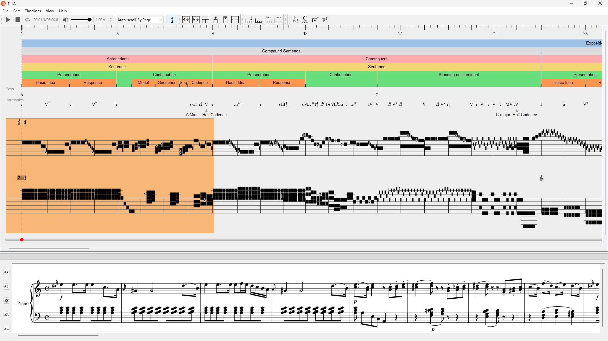

# Summary

'TiLiA' (**Ti**me**Li**ne **A**nnotator) is an open-source, cross-platform network of tools and resources designed to facilitate real-time creating, displaying and interacting with timeline-style annotations of audio, video and musical scores. Developed in Python with the PyQt UI framework, TiLiA is available primarily as a desktop Graphical User Interface (GUI),supported by a Command Line Interface (CLI) as well as a free and open online platform where users may upload, view and query existing analyses.

# Statement of need

Visual analyses of music have proven to be an enduringly popular, effective, and versatile tool for conveying a variety of musical ideas. [^0] As the famous adage goes: 'a picture is worth a thousand words'. These analytical images are primarily connected to the *analysis* rather than the *music*, thus making them readily useful not only for the already visual sources of notated music, but also for the much broader range of musical styles and repertoires that are transmitted without the use of notation.

[^0]: See @isaacson:2023 for a survey of this long history.

Whatever potential a *static* image has, an *interactive* one offers considerably more. Formal analysis is one of the clearest beneficiaries of the visual summary of music. Form can be hard to parse (especially in real-time) but is often easy to understand in relatively simple, at-a-glance summaries.

Save for a few exceptions [@gotham:2019], musical scholarship has not yet made the leap into this technological space with any degree of decisiveness or consistency.
Even most visually minded music analyses are consigned to static images embedded in print (or in e-copies at best) and not subject to the expectations for _fair_,
open-source data sharing that are now *de rigueur* in other fields.
Still among the more computationally inclined communities, there has been little progress made on the coordination of standards and corpora for formal analysis.

In today's digital age, we have come to expect certain basic interactive
features across visual interfaces, such as **resizing**
content to fit the window, keyboard shortcuts, undo/redo functionality, and so on. Musical contexts extend this with additional
expectations, such as **real-time synchronisation** (a.k.a., audio or
score following). Any tool that aims to win over users effectively must present analytical ideas naturally and intuitively, with minimal friction in the user interface.

While one _can_ appropriate tools (which primary purpose is editing scores or audio) for creating visual analyses, [^1] [^2] the current range of tools dedicated to the task typically offer limited functionality and their uptake by the wider community haws been minimal. [^3]

[^1]: The music notation software _Sibelius_, for instance, has offered a timeline since c.2019 with bar numbers and rudimentary checkpoints for changes to time and key signatures, presumably because they are possible indicators of section breaks. @peebles:2013 discusses how to use an audio editor (_Audacity_) in a similar way to the tools discussed here.

[^2]: Additionally, websites like _Edirom Online_ [@rowenstrunk:2014], _Listen Here!_ [@weigl:2023] and _mei-friend_ [@goebl:2024] support the digital annotation of scores, not specific to analysis.

[^3]: Yorgason's _Audio Timeliner_ [@yorgason:2018], based on the original _Variations Audio Timeliner_ [@notess:2004], is notable for capturing the needs of its users with its simple design. _Dezrann_ [@giraud:2018] is another noteworthy, actively maintained website that allows the alignment of score data on top of annotation.

In response to these challenges (user-friendly design, interoperable
formats, real-time interactivity ... ), we present 'TiLiA': a timeline
annotator for all.

# Specifications

TiLiA consists of an organisation of digital tools, primarily of its [open-source desktop application and command-line interface](https://github.com/TimeLineAnnotator/desktop), but also of a supporting online platform, which we plan to make open-source in the future. The desktop application is developed in Python using the PyQt binding for the Qt UI framework. Automated testing is done with `pytest`, and partially-automated deployment is available via GitHub Actions. The code base is loosely organized around a Model-View-Controller (MVC) pattern, which allows both the CLI and the GUI to benefit from the same backend logic. We provide object-oriented base classes such as `Timeline`, `TimelineUI` and `TimelineComponent` as a means to promote extensibility and support an evergrowing range of annotation needs.

TiLiA is designed to facilitate the *creation* of analyses —
particularly where this requires complex alignment with audio/video sources —
and the (conversion and) *import* of analyses of external origin through CSV files.
This effort thus connects TiLiA to wider datasets and scholarship, while also expanding its
functionality. The [tilia-dcml](https://github.com/TimeLineAnnotator/dcml-to-tilia) repository demonstrates how the TiLiA CLI might be used to visualise data from an external corpus of musical analyses. The CLI can also *export* timelines created in TiLiA to a JSON file suitable for processing by other software.

## The desktop application

The main part of TiLiA is a cross-platform *What-You-See-Is-What-You-Get* GUI (\autoref{fig:example}), designed to feel intuitive to anyone who has worked with audiovisual editing software.
A TiLiA analysis consists of timelines, each containing annotations that can be aligned to an audio, video, YouTube stream or musical score.
Each *timeline type* is designed to support conventional formal annotations, with the affordance to work with a variety of other analytical styles.
These timelines each contain one or more *component types*
(e.g., markers for marker timelines), each with different
*properties* to convey information including comments, colour and labels.

Currently, there are six types of timelines:

- **Audiowave timelines**, for displaying amplitude graphs
- **Harmony timelines**, for displaying properly formatted chord symbols and roman numeral analysis
- **Hierarchy timelines**, for representing hierarchical structures
- **Marker timelines**, for highlighting discrete timepoints
- **PDF timelines**, for synchronising PDF documents with playback
- **Score timeline**, for synchronising a to-scale and synchronized "piano roll" notation as well as conventional musical notation from digital scores with playback

## Command-line interface
In addition to the desktop GUI and the web app, a **command line
interface** allows the automation of file and timeline creation and
edition, media loading and external data importing. Sequences of
commands can be loaded by the CLI from scripts written in plain text
files, enabling programmatic conversion from various data formats to TiLiA files.

    metadata set-media-length 120
    timelines add hierarchy --name "Form"
    timelines add marker --name "Formal closures"
    timelines add hierarchy --name "Harmonic segments"
    timelines add beat --name "Measures" --beat-pattern 1
    timelines add marker --name "Harmony"
    timelines add marker --name "Harm. functions"
    timelines add marker --name "Keys"

    load-media <path to audio> --scale-timelines yes
    metadata set title "Title"
    save --overwrite <path to TiLiA file>

## Online platform

The TiLiA desktop application is supported by an [online platform](tilia-app.com) that lets users store, share,
visualise and even query existing analyses. Registration is free and is only required for uploading content.
This reflects a goal of TiLiA to support not only the modernised creation and
storage of analyses, but also to support the
still-rare practice of analytical *collaboration* and structured
*searches* on the corpora; both which benefit from network effects
facilitated by the lowered entry barrier.

# References
